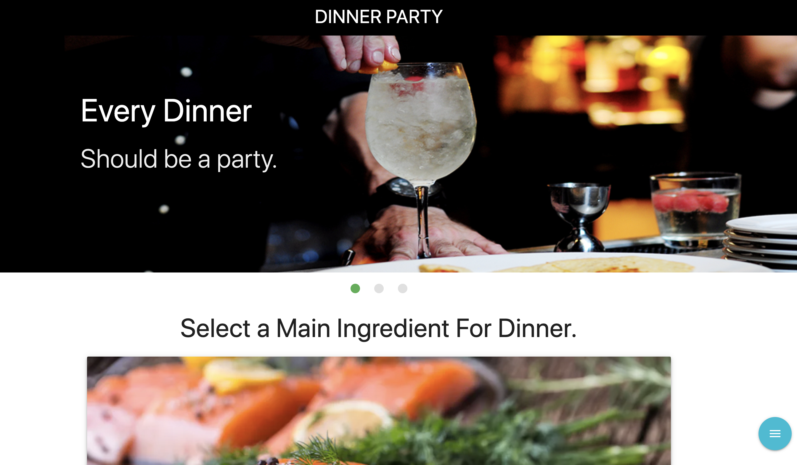

# project1


## Summary 


## Site Picture 


 
## Technologies Used
- Materialize CSS - Used to pull existing html and CSS for creating responsive organizational structer and styling for the site. In addtion, pulling from their JS library's built in scripts to utilize plugins for animations.
- jQuery - Used for event listeners of parent and childeren elements as well as to store and recall those varible in local      storage to be displayed dynamically in HTML on the page.
- momentjs - Used to pull current date for the current city.
- javascript - Used to dynamically change html and store user-input.
- HTML - Used to create elements on the DOM
- CSS - Styles html elements on page
- Git - Version control system to track changes to source code
- GitHub - Hosts repository that can be deployed to GitHub Pages
 


## Code Snippet


```html

```

```js


```


## Built With

* [API]()
* [API]()
* [Materialize CSS](http://archives.materializecss.com/0.100.2/about.html)
* [jQuery](https://api.jquery.com/)
* [HTML](https://developer.mozilla.org/en-US/docs/Web/HTML)
* [CSS](https://developer.mozilla.org/en-US/docs/Web/CSS)
* [Boostrap](https://getbootstrap.com/)

## Authors

**Chris Melby** 
**Kevin o** 
**Tai Le** 
**Carlos Toledo** 

- [Link to Portfolio Site](#)
- [Link to Github]()
